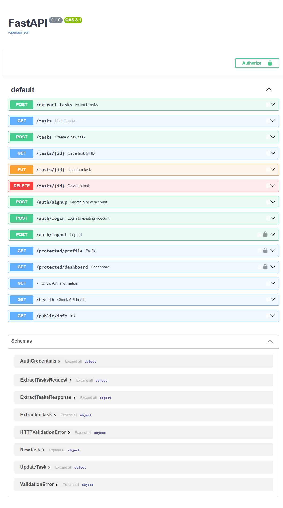

# Task API

A secure CRUD API built with FastAPI and SQLite for managing tasks.

The application uses a service and repository architecture to separate API logic from database logic. SQLite is used for persistent task storage, and the application is containerized with Docker.

Supabase Auth is used for user authentication. Users can sign up, log in, receive JWT access and refresh tokens, and use the access token to access protected API endpoints.

## Features

* Create, view, update, and delete tasks
* Persistent task storage using SQLite
* Dockerized FastAPI application
* User signup, login, and logout using Supabase Auth
* Task extraction from text using an LLM

## Architecture

The task functionality is separated into three main layers:

```text
FastAPI Routes
      ↓
Task Service
      ↓
SQLite Repository
      ↓
SQLite Database
```

`main.py` creates the FastAPI application and registers its routers and exception handler.

`src/routes/` contains endpoints grouped by purpose: task operations, authentication, protected endpoints, general information, and task extraction.

`src/dependencies.py` loads environment configuration and creates the shared repository, task service, and Supabase client.

`src/auth.py` contains the reusable authentication dependency used to verify access tokens.

`src/exception_handlers.py` handles request-validation errors, returning 400 for invalid task-extraction requests while preserving FastAPI's default behavior for other routes.

`src/llm/schema.py` defines the task-extraction output models.

`service.py` contains the application logic and task validation.

`repository.py` contains the SQLite database operations and SQL queries.

The routes do not directly execute SQL queries. Instead, they communicate with the service, which uses the repository for persistence.

Authentication is handled separately through Supabase Auth.

## Why SQLite?

SQLite was used as the approved alternative to PostgreSQL for this project.

It is lightweight, simple to use, and does not require a separate database server. It stores the database in a single file while still allowing the project to demonstrate persistent storage, SQL operations, repository architecture, Docker volumes, and environment-based configuration.

## Authentication

Authentication is handled using Supabase Auth.

A user first creates an account using:

```text
POST /auth/signup
```

The user can then log in using:

```text
POST /auth/login
```

After a successful login, Supabase returns:

* An access token
* A refresh token

The access token is a JSON Web Token (JWT).

Protected endpoints require the access token to be sent using the HTTP `Authorization` header:

```text
Authorization: Bearer <access_token>
```

FastAPI extracts the Bearer token using `HTTPBearer`.

The token is then sent to Supabase Auth for verification. If the token is valid, Supabase returns the authenticated user and the protected endpoint is allowed to run.

Invalid, expired, or modified tokens are rejected with an authentication error.

## Database

The SQLite database contains a `tasks` table with the following columns:

| Column  | Type    | Description                             |
| ------- | ------- | --------------------------------------- |
| `id`    | INTEGER | Unique ID for each task and primary key |
| `title` | TEXT    | Task title                              |
| `done`  | BOOLEAN | Whether the task has been completed     |

If the table is empty when the application starts, three example tasks are automatically added.

## Environment Configuration

Application configuration is stored using environment variables.

Create your local `.env` file using `.env.example` as a template.

### LLM configuration

The application can switch between local and hosted models that support the same API format by changing `LLM_BASE_URL`, `LLM_API_KEY`, and `LLM_MODEL`, without modifying the Python code.

### Supabase setup

1. Create a project at Supabase.
2. Find the project URL.
3. Find the project's publishable key or legacy anon key.
4. Add both values to your local `.env` file.

## Running with Docker

### Requirements

Install:

* Docker Desktop
* Git

Make sure Docker Desktop is running.

### 1. Clone the repository

```powershell
git clone https://github.com/jrupasinghe222-ux/flyrank-crud-api
```

Open the project directory.

### 2. Create the environment file

Copy `.env.example` to `.env`.

Add your Supabase project URL and key, configure the LLM provider settings, and set `LLM_ENABLED=true` and `LLM_STUB=0` to use real model calls.

### 3. Build and start the application

```powershell
docker compose up --build
```

After the image has already been built, the application can also be started with:

```powershell
docker compose up
```

The API is available at:

```text
http://localhost:8000
```

Swagger UI is available at:

```text
http://localhost:8000/docs
```

### Stop the application

```powershell
docker compose down
```

The SQLite database remains stored in the Docker volume.

## Docker Persistence

SQLite data is stored in a Docker named volume mounted at `/app/data` inside the application container.

```text
FastAPI Container
       ↓
/app/data/tasks.db
       ↓
Docker Named Volume
```
When running locally from the project root, `DATABASE_PATH=./data/tasks.db` stores the database in the project's `data` folder. Inside Docker, the same relative path resolves to `/app/data/tasks.db`. Local and Docker runs use separate databases.

Persistence was verified using the following process:

1. Started the application using Docker Compose.
2. Created a new task through the API.
3. Used `GET /tasks` to confirm the task had been stored.
4. Stopped and removed the application container:

```powershell
docker compose down
```

5. Started the application again:

```powershell
docker compose up -d
```

6. Used `GET /tasks` again and confirmed that the previously created task was still present.

This shows that task data survives application restarts and container removal because `tasks.db` is stored in the persistent Docker volume.

## API Reference

| Method | Endpoint               | Description                                   | Authentication Required |
| ------ | ---------------------- | --------------------------------------------- | ----------------------- |
| GET    | `/`                    | Show API information                          | No                      |
| GET    | `/health`              | Check API health                              | No                      |
| GET    | `/tasks`               | Get all tasks                                 | No                      |
| GET    | `/tasks/{id}`          | Get a task by ID                              | No                      |
| POST   | `/tasks`               | Create a task                                 | No                      |
| PUT    | `/tasks/{id}`          | Update a task                                 | No                      |
| DELETE | `/tasks/{id}`          | Delete a task                                 | No                      |
| POST   | `/auth/signup`         | Create a user account                         | No                      |
| POST   | `/auth/login`          | Log in and receive access and refresh tokens  | No                      |
| POST   | `/auth/logout`         | Log out an authenticated user                 | Yes                     |
| GET    | `/public/info`         | Return public information                     | No                      |
| GET    | `/protected/profile`   | Return authenticated user profile information | Yes                     |
| GET    | `/protected/dashboard` | Return protected dashboard information        | Yes                     |
| POST | `/extract_tasks` | Extract tasks from text | No |

## Task Extraction

The task extraction endpoint turns written text into a list of tasks with simple titles and completion statuses. It identifies both completed and unfinished tasks, treats uncertain completion as unfinished, and ignores statements without clear tasks. The results are checked before being returned and are not automatically saved to the database.

### Example request

With `LLM_ENABLED=true` and `LLM_STUB=0`, run in Windows PowerShell:

```powershell
curl.exe --% -i -X POST http://localhost:8000/extract_tasks -H "Content-Type: application/json" -d "{\"text\":\"I submitted the expense report. I still need to call the plumber.\"}"
```

Recorded successful response: `200 OK`

```json
{
  "tasks": [
    {"title": "Submit the expense report", "done": true},
    {"title": "Call the plumber", "done": false}
  ]
}
```

The response above was observed during evaluation. Model-generated titles may vary between requests.

### Job card

**What it does:** Extracts tasks explicitly mentioned in text and returns a simple title and completion status for each task.

**Input:** A required `text` field containing 1–2000 characters. Empty and whitespace-only input is rejected.

**Output:** An object containing a `tasks` list. Each task contains a non-empty string `title` and a boolean `done`. When no tasks are found, the list is empty.

**It must never:**

* Invent tasks that are not mentioned in the input.
* Break tasks into additional steps that were not mentioned.
* Change the meaning when simplifying a title.
* Mark a task as completed without clear evidence.
* Return extra fields or raw model text to the caller.

**When unsure:** Completion is set to `false` when it is unclear. Statements are excluded when it is unclear whether they describe a task. Explicit goals count as tasks, while situations alone do not.

### Provider and model

The evaluation used OpenRouter with `LLM_MODEL=openrouter/free`. This routes requests to available free models, so the evaluation was not performed using one fixed model. The model selected for each call is recorded in the usage log.

The application uses three environment variables for provider configuration:

| Variable | Purpose |
| -------- | ------- |
| `LLM_BASE_URL` | Provider API address |
| `LLM_API_KEY` | Provider API key |
| `LLM_MODEL` | Model or router identifier |

Example OpenRouter configuration:

```dotenv
LLM_BASE_URL=https://openrouter.ai/api/v1
LLM_API_KEY=your_openrouter_api_key
LLM_MODEL=openrouter/free
```

The application can switch between local and hosted models that support the same API format by changing these variables without modifying the Python code. The connection script was also tested with a local Llama 3.1 model through Ollama.

### Evaluation results

Task extraction was evaluated using eight labelled cases with stub mode disabled. The cases cover completed tasks, unfinished tasks, uncertain completion, multiple tasks, goals, and text without clear tasks.

| Item | Result |
| ---- | ------ |
| Evaluation date | 2026-09-08 |
| Prompt version | `extract-tasks-v1` |
| Scoring method | Exact response matching |
| Cases passed | 7 out of 8 |
| Score | 87.5% |

In the failed case the title preserved the intended meaning, but the wording difference was rejected by exact matching.

With the API running, `LLM_ENABLED=true`, and `LLM_STUB=0`, run the evaluation from the project root:

```powershell
python evals/run.py
```

The script prints the result of each case, the expected and actual responses for mismatches, and the final score.

### Usage logging and cost estimate

Each model call records the prompt version, model, token usage, duration, attempt number, and repair information.

Example log from the evaluation:

```json
{
  "event": "llm_call",
  "prompt_version": "extract-tasks-v1",
  "model": "inclusionai/ling-3.0-flash-sante:free",
  "input_tokens": 717,
  "output_tokens": 57,
  "duration_ms": 1358.58,
  "attempt": 1,
  "is_repair": false,
  "repair_count": 0,
  "response_received": true
}
```

The eight evaluation requests produced nine model calls, including one repair and no network retries. Total usage was 5,751 input tokens and 2,093 output tokens.

At the observed usage and repair rate, 10,000 requests per day would use approximately 7.19 million input tokens, 2.62 million output tokens, and 11,250 model calls, with an estimated $0 model API charge at free-model pricing, excluding hosting costs and subject to provider limits.

This estimate is based on eight examples and does not imply that the free tier supports this request volume. Usage will vary with input length, model selection, output length, and the number of repairs and retries.

### Future improvement

The evaluation would be improved to accept equivalent task titles while still checking the action and completion status.

### Invalid request

Run in Windows PowerShell:

```powershell
curl.exe --% -i -X POST http://localhost:8000/extract_tasks -H "Content-Type: application/json" -d "{\"text\":\"\"}"
```

Expected status: `400 Bad Request`

```json
{
  "detail": [
    {
      "field": "text",
      "message": "String should have at least 1 character"
    }
  ]
}
```

Invalid input is rejected before any model call.

### Output validation and repair

Model output is parsed and validated against the task extraction schema before it is returned. The parser handles JSON wrapped in Markdown code fences and introductory text before a JSON object.

If parsing or validation fails, the application makes one repair request containing the rejected answer and validation error. The repaired answer is checked against the same schema.

If the repair also fails, the endpoint returns `422 Unprocessable Entity`. The input, rejected output, error, and prompt version are recorded in `logs/quarantine.jsonl`. 

### Timeout and retry policy

The model client uses a 30-second network timeout with SDK retries disabled. The application allows one retry for timeouts, 429 responses, and 5xx responses, using exponential backoff with jitter.

Valid Retry-After values are followed up to five seconds. Longer waits stop the retry. Responses with status 400, 401, or 403 are not retried.

The timeout applies to network operations rather than the complete endpoint duration. An extraction request can include an initial model call, one repair call, and up to one network retry for each call.

### Stub mode and kill switch

The following environment variables control task extraction:

| Setting | Behavior |
| ------- | -------- |
| `LLM_ENABLED=false` | Returns 503 without calling the model |
| `LLM_ENABLED=true` and `LLM_STUB=1` | Returns a fixed example response without calling the model |
| `LLM_ENABLED=true` and `LLM_STUB=0` | Calls the configured model and validates its response |

Restart the application after changing `.env` so the updated settings are loaded.

### Error responses

| Status | Meaning |
| ------ | ------- |
| 400 | Request input failed validation |
| 422 | Model output remained invalid after one repair |
| 502 | The provider rejected or could not complete the upstream request |
| 503 | Task extraction is disabled, or the provider returned a rate-limit or server error after the retry policy stopped further attempts |
| 504 | The model request timed out after the retry policy was exhausted |

### Prompt testing observations

The model added Markdown code fences during testing despite the prompt requesting JSON only. Repeated inputs also produced different results on separate calls.
Some model responses contained safety labels instead of task data.

## Authentication Example

### Sign up

Send:

```json
{
  "email": "test@example.com",
  "password": "password123"
}
```

to:

```text
POST /auth/signup
```

A successful signup returns status:

```text
201 Created
```

### Log in

Send the same email and password to:

```text
POST /auth/login
```

A successful login returns:

```json
{
  "access_token": "<JWT>",
  "refresh_token": "<refresh_token>"
}
```

### Access a protected route

Send the access token in the `Authorization` header:

```text
Authorization: Bearer <access_token>
```

For example:

```text
GET /protected/profile
```

If the token is valid, the endpoint returns the authenticated user's ID, email, and account creation time.

If the token is invalid, modified, or expired, the request is rejected.

## Swagger UI

FastAPI automatically generates interactive API documentation using Swagger UI.

Open:

```text
http://localhost:8000/docs
```

The protected endpoints display lock icons because the API uses FastAPI's `HTTPBearer` security scheme.

To test authentication:

1. Run `POST /auth/login`.
2. Copy the returned `access_token`.
3. Click **Authorize** in Swagger UI.
4. Paste the access token.
5. Authorize the request.
6. Run `GET /protected/profile` or another protected endpoint.

Swagger automatically sends the token using:

```text
Authorization: Bearer <access_token>
```

### Swagger UI Screenshot



## Example SQL Query

The SQLite database can also be queried directly.

For example, this query returns all completed tasks:

```sql
SELECT * FROM tasks WHERE done = 1;
```

Other SQL operations were also used to inspect, update, and delete task records.

## Database Viewer

The SQLite database was opened using DB Browser for SQLite to inspect the `tasks` table and execute SQL queries manually.


## Security

The project follows several basic security practices:

* Password authentication is handled by Supabase Auth rather than storing passwords in the local SQLite database.
* Protected routes require a JWT access token.
* Access tokens are verified through Supabase before protected route logic runs.
* FastAPI uses a reusable authentication dependency to avoid duplicating authentication checks across routes.
* Real environment values are stored in `.env`.
* `.env` is excluded from Git.
* `.env.example` contains only configuration placeholders.

## Project Setup Summary

A new developer should be able to run the application by:

```text
1. Clone repository
2. Create a Supabase project
3. Copy .env.example to .env
4. Add Supabase URL and publishable/anon key
5. Configure LLM_BASE_URL, LLM_API_KEY, and LLM_MODEL, then set LLM_ENABLED=true and LLM_STUB=0
6. Run docker compose up --build
7. Open http://localhost:8000/docs
8. Sign up and log in
9. Authorize Swagger using the returned JWT
10. Test the API
```
