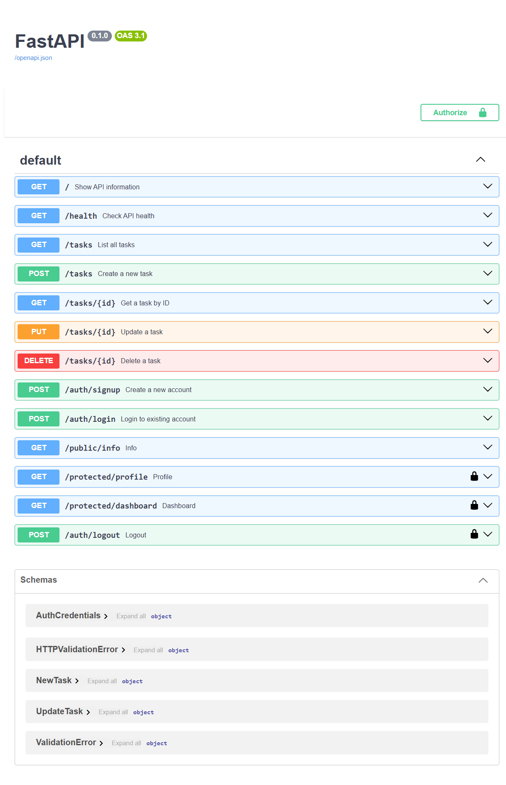

# Task API

A secure CRUD API built with FastAPI and SQLite for managing tasks.

The application uses a service and repository architecture to separate API logic from database logic. SQLite is used for persistent task storage, and the application is containerized with Docker.

Supabase Auth is used for user authentication. Users can sign up, log in, receive JWT access and refresh tokens, and use the access token to access protected API endpoints.

## Features

* Create a new task
* View all tasks
* View a task by ID
* Update a task
* Mark a task as done
* Delete a task
* Persistent task storage using SQLite
* Repository and service architecture
* Environment-based configuration
* Dockerized FastAPI application
* Docker Compose setup
* Persistent Docker volume for the SQLite database
* User signup using Supabase Auth
* User login using email and password
* JWT access and refresh tokens
* Bearer-token authentication
* Protected API endpoints
* JWT verification through Supabase
* Reusable FastAPI authentication dependency
* User logout
* Public and protected routes
* Interactive Swagger UI
* Swagger Bearer authentication using the Authorize button

## Architecture

The task functionality is separated into three main layers:

```text
FastAPI Routes
      ↓
Task Service
      ↓
SQLite Repository
      ↓
SQLite Database
```

`main.py` contains the FastAPI routes, application configuration, Supabase client setup, and authentication dependency.

`service.py` contains the application logic and task validation.

`repository.py` contains the SQLite database operations and SQL queries.

The routes do not directly execute SQL queries. Instead, they communicate with the service, which uses the repository for persistence.

Authentication is handled separately through Supabase Auth.

## Why SQLite?

SQLite was used as the approved alternative to PostgreSQL for this project.

It is lightweight, simple to use, and does not require a separate database server. It stores the database in a single file while still allowing the project to demonstrate persistent storage, SQL operations, repository architecture, Docker volumes, and environment-based configuration.

## Authentication

Authentication is handled using Supabase Auth.

A user first creates an account using:

```text
POST /auth/signup
```

The user can then log in using:

```text
POST /auth/login
```

After a successful login, Supabase returns:

* An access token
* A refresh token

The access token is a JSON Web Token (JWT).

Protected endpoints require the access token to be sent using the HTTP `Authorization` header:

```text
Authorization: Bearer <access_token>
```

FastAPI extracts the Bearer token using `HTTPBearer`.

The token is then sent to Supabase Auth for verification. If the token is valid, Supabase returns the authenticated user and the protected endpoint is allowed to run.

Invalid, expired, or modified tokens are rejected with an authentication error.

## Database

The SQLite database contains a `tasks` table with the following columns:

| Column  | Type    | Description                             |
| ------- | ------- | --------------------------------------- |
| `id`    | INTEGER | Unique ID for each task and primary key |
| `title` | TEXT    | Task title                              |
| `done`  | BOOLEAN | Whether the task has been completed     |

If the table is empty when the application starts, three example tasks are automatically added.

## Environment Configuration

Application configuration is stored using environment variables.

Create your local `.env` file using `.env.example` as a template.

### LLM configuration

The application can switch between local and hosted models that support the same API format by changing `LLM_BASE_URL`, `LLM_API_KEY`, and `LLM_MODEL`, without modifying the Python code.

### Supabase setup

1. Create a project at Supabase.
2. Find the project URL.
3. Find the project's publishable key or legacy anon key.
4. Add both values to your local `.env` file.

## Running with Docker

### Requirements

Install:

* Docker Desktop
* Git

Make sure Docker Desktop is running.

### 1. Clone the repository

```powershell
git clone <repository-url>
```

Open the project directory.

### 2. Create the environment file

Copy `.env.example` to `.env`.

Then add your own Supabase project URL and key.

### 3. Build and start the application

```powershell
docker compose up --build
```

After the image has already been built, the application can also be started with:

```powershell
docker compose up
```

The API is available at:

```text
http://localhost:8000
```

Swagger UI is available at:

```text
http://localhost:8000/docs
```

### Stop the application

```powershell
docker compose down
```

The SQLite database remains stored in the Docker volume.

## Docker Persistence

SQLite data is stored in a Docker named volume mounted at `/data` inside the application container.

```text
FastAPI Container
       ↓
/data/tasks.db
       ↓
Docker Named Volume
```

Persistence was verified using the following process:

1. Started the application using Docker Compose.
2. Created a new task through the API.
3. Used `GET /tasks` to confirm the task had been stored.
4. Stopped and removed the application container:

```powershell
docker compose down
```

5. Started the application again:

```powershell
docker compose up -d
```

6. Used `GET /tasks` again and confirmed that the previously created task was still present.

This shows that task data survives application restarts and container removal because `tasks.db` is stored in the persistent Docker volume.

## API Reference

| Method | Endpoint               | Description                                   | Authentication Required |
| ------ | ---------------------- | --------------------------------------------- | ----------------------- |
| GET    | `/`                    | Show API information                          | No                      |
| GET    | `/health`              | Check API health                              | No                      |
| GET    | `/tasks`               | Get all tasks                                 | No                      |
| GET    | `/tasks/{id}`          | Get a task by ID                              | No                      |
| POST   | `/tasks`               | Create a task                                 | No                      |
| PUT    | `/tasks/{id}`          | Update a task                                 | No                      |
| DELETE | `/tasks/{id}`          | Delete a task                                 | No                      |
| POST   | `/auth/signup`         | Create a user account                         | No                      |
| POST   | `/auth/login`          | Log in and receive access and refresh tokens  | No                      |
| POST   | `/auth/logout`         | Log out an authenticated user                 | Yes                     |
| GET    | `/public/info`         | Return public information                     | No                      |
| GET    | `/protected/profile`   | Return authenticated user profile information | Yes                     |
| GET    | `/protected/dashboard` | Return protected dashboard information        | Yes                     |
| POST | `/extract_tasks` | Extract tasks from text | No |
## Task Extraction

`POST /extract_tasks` accepts text and returns a list of tasks containing a title and completion status.

### Valid request

Run in Windows PowerShell:

```powershell
curl.exe --% -i -X POST http://localhost:8000/extract_tasks -H "Content-Type: application/json" -d "{\"text\":\"I watered the plants. I need to feed the cat.\"}"
```

Expected status: `200 OK`

```json
{
  "tasks": [
    {"title": "Water plants", "done": true},
    {"title": "Feed cat", "done": false}
  ]
}
```

### Invalid request

Run in Windows PowerShell:

```powershell
curl.exe --% -i -X POST http://localhost:8000/extract_tasks -H "Content-Type: application/json" -d "{\"text\":\"\"}"
```

Expected status: `400 Bad Request`

```json
{
  "detail": [
    {
      "field": "text",
      "message": "String should have at least 1 character"
    }
  ]
}
```


## Authentication Example

### Sign up

Send:

```json
{
  "email": "test@example.com",
  "password": "password123"
}
```

to:

```text
POST /auth/signup
```

A successful signup returns status:

```text
201 Created
```

### Log in

Send the same email and password to:

```text
POST /auth/login
```

A successful login returns:

```json
{
  "access_token": "<JWT>",
  "refresh_token": "<refresh_token>"
}
```

### Access a protected route

Send the access token in the `Authorization` header:

```text
Authorization: Bearer <access_token>
```

For example:

```text
GET /protected/profile
```

If the token is valid, the endpoint returns the authenticated user's ID, email, and account creation time.

If the token is invalid, modified, or expired, the request is rejected.

## Swagger UI

FastAPI automatically generates interactive API documentation using Swagger UI.

Open:

```text
http://localhost:8000/docs
```

The protected endpoints display lock icons because the API uses FastAPI's `HTTPBearer` security scheme.

To test authentication:

1. Run `POST /auth/login`.
2. Copy the returned `access_token`.
3. Click **Authorize** in Swagger UI.
4. Paste the access token.
5. Authorize the request.
6. Run `GET /protected/profile` or another protected endpoint.

Swagger automatically sends the token using:

```text
Authorization: Bearer <access_token>
```

### Swagger UI Screenshot



## Example SQL Query

The SQLite database can also be queried directly.

For example, this query returns all completed tasks:

```sql
SELECT * FROM tasks WHERE done = 1;
```

Other SQL operations were also used to inspect, update, and delete task records.

## Database Viewer

The SQLite database was opened using DB Browser for SQLite to inspect the `tasks` table and execute SQL queries manually.


## Security

The project follows several basic security practices:

* Password authentication is handled by Supabase Auth rather than storing passwords in the local SQLite database.
* Protected routes require a JWT access token.
* Access tokens are verified through Supabase before protected route logic runs.
* FastAPI uses a reusable authentication dependency to avoid duplicating authentication checks across routes.
* Real environment values are stored in `.env`.
* `.env` is excluded from Git.
* `.env.example` contains only configuration placeholders.

## Project Setup Summary

A new developer should be able to run the application by:

```text
1. Clone repository
2. Create a Supabase project
3. Copy .env.example to .env
4. Add Supabase URL and publishable/anon key
5. Run docker compose up --build
6. Open http://localhost:8000/docs
7. Sign up and log in
8. Authorize Swagger using the returned JWT
9. Test the API
```
