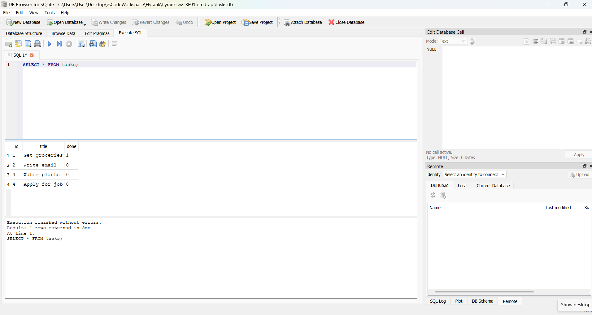
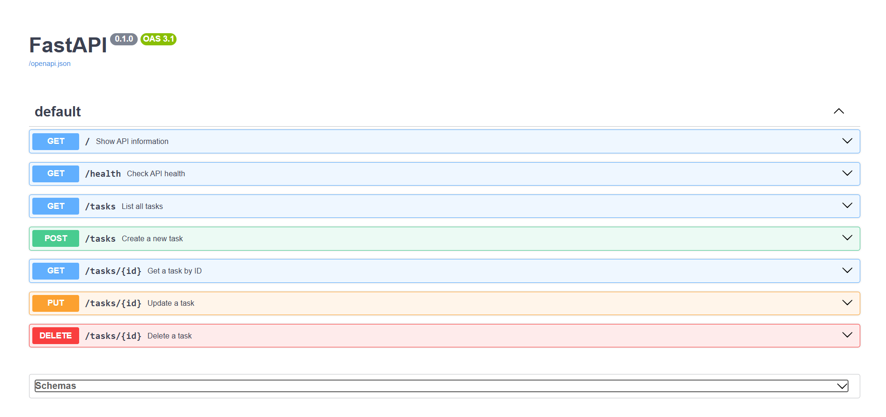

# Task API

A simple CRUD API built with FastAPI and SQLite for managing a to-do list.

The API allows users to create, read, update, and delete tasks. Tasks are stored in a SQLite database, so the data persists even when the server is restarted.

## Features

* Create a new task
* View all tasks
* View a task by ID
* Update a task
* Mark a task as done
* Delete a task
* Store tasks persistently using SQLite
* Health check endpoint
* Interactive Swagger UI documentation

## Why SQLite?

SQLite was chosen because it is simple, lightweight, and does not require a separate database server. The database is stored as a single file, which makes it a good choice for a small project like this while learning how an API interacts with a database.

## Database

The database is stored in a file called:

```text
tasks.db
```

The file is created automatically in the project directory when the application starts.

The `tasks` table contains:

| Column  | Type    | Description                                 |
| ------- | ------- | ------------------------------------------- |
| `id`    | INTEGER | Unique ID for each task and the primary key |
| `title` | TEXT    | The task title                              |
| `done`  | BOOLEAN | Whether the task has been completed         |

If the table is empty when the application starts, three example tasks are automatically added.

## Installation and Running

Clone the repository and open the project folder.

Create and activate a virtual environment:

```powershell
python -m venv .venv
.venv\Scripts\activate
```

Install the dependencies:

```powershell
pip install -r requirements.txt
```

Start the API:

```powershell
uvicorn main:app --reload
```

The API will be available at:

```text
http://localhost:8000
```

Swagger UI:

```text
http://localhost:8000/docs
```

## Endpoints

| Method | Endpoint      | Description                 |
| ------ | ------------- | --------------------------- |
| GET    | `/`           | Show API information        |
| GET    | `/health`     | Check if the API is running |
| GET    | `/tasks`      | Get all tasks               |
| GET    | `/tasks/{id}` | Get a task by ID            |
| POST   | `/tasks`      | Create a new task           |
| PUT    | `/tasks/{id}` | Update a task               |
| DELETE | `/tasks/{id}` | Delete a task               |

## Example Request

Create a new task:

```powershell
curl.exe -i -X POST http://localhost:8000/tasks -H "Content-Type: application/json" -d "{\"title\":\"Buy milk\"}"
```

Example response:

```text
HTTP/1.1 201 Created
date: [date]
server: uvicorn
content-length: [length]
content-type: application/json

{"id":4,"title":"Buy milk","done":false}
```

## Example SQL Query

The database can also be queried directly using SQLite. For example, this query returns all completed tasks:

```sql
SELECT * FROM tasks WHERE done = 1;
```

Other SQL operations were used to inspect, update, and delete task records directly from the database.

## Database Viewer

The SQLite database was opened using DB Browser for SQLite to inspect the `tasks` table and execute SQL queries manually.



Changes made directly to the database are immediately reflected when retrieving tasks through the API.

## Swagger UI

FastAPI automatically generates interactive API documentation using Swagger UI.

Open:

```text
http://localhost:8000/docs
```

You can test all CRUD operations directly from the Swagger interface.


